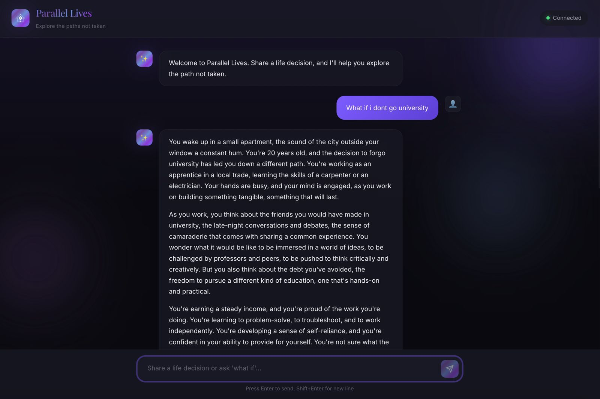

# Parallel Lives

**AI-powered life path explorer** - Explore the roads not taken through immersive "what-if" narratives.

Built with Cloudflare Workers AI, Durable Objects, and WebSockets.

 



## Overview

Share a pivotal life decision you've made, and the AI generates vivid narratives of alternate paths you could have taken. The application remembers your life story across sessions, building deeper context over time.

### Features

- 🎭 **Alternate Path Narratives** - AI generates immersive second-person stories of paths not taken
- 🧠 **Persistent Memory** - Remembers your life story across sessions via Durable Objects
- ⚡ **Real-time Chat** - WebSocket-based instant communication


## Architecture

```
┌─────────────────┐     WebSocket      ┌─────────────────┐
│   Frontend UI   │◄──────────────────►│     Worker      │
│   (Pages)       │                    │  (Entry Point)  │
└─────────────────┘                    └────────┬────────┘
                                                │
                              ┌─────────────────┼─────────────────┐
                              ▼                                   ▼
                    ┌─────────────────┐               ┌─────────────────┐
                    │  Durable Object │               │   Workers AI    │
                    │   (UserMemory)  │               │ (Llama 3.3 70B) │
                    └─────────────────┘               └─────────────────┘
```

## Tech Stack

| Component | Technology | Purpose |
|-----------|------------|---------|
| LLM | Workers AI - Llama 3.3 70B | Narrative generation |
| State | Durable Objects | Persistent user memory |
| Coordination | Workers + WebSocket | Real-time communication |
| Frontend | Static Assets (Pages) | Chat interface |

## Prerequisites

- Node.js 18+
- npm or yarn
- Cloudflare account (free tier works)

## Getting Started

### 1. Install Dependencies

```bash
cd cf_ai_parallel_lives
npm install
```

### 2. Login to Cloudflare

Workers AI requires authentication even for local development:

```bash
npx wrangler login
```

This opens a browser window - log in and authorize wrangler.

### 3. Run Locally

```bash
npm run dev
```

Open **http://localhost:8787** in your browser.

### 4. Test the Application

1. Wait for "Connected" status (green dot in header)
2. Click an example prompt or type your own life decision
3. Press Enter to send
4. Wait for the AI to generate an alternate path narrative

## Project Structure

```
cf_ai_parallel_lives/
├── wrangler.toml           # Cloudflare configuration
├── package.json            # Dependencies
├── tsconfig.json           # TypeScript config
├── PROMPTS.md              # AI prompts documentation
├── src/
│   ├── index.ts            # Worker entry point + WebSocket handler
│   ├── user-memory.ts      # Durable Object for state persistence
│   └── prompts.ts          # AI system prompts and context builders
└── public/
    ├── index.html          # Chat UI structure
    ├── styles.css          # Premium dark theme styling
    └── app.js              # Frontend WebSocket logic
```

## Components

### Worker (`src/index.ts`)

Entry point handling:
- WebSocket upgrade on `/ws` path
- Health check API at `/api/health`
- Static asset serving via assets binding

### Durable Object (`src/user-memory.ts`)

Persistent state management:
- Stores conversation history (last 20 messages)
- Tracks life decisions explored (last 50)
- Maintains AI-generated life summary
- Persists across sessions per user

### AI Prompts (`src/prompts.ts`)

See [PROMPTS.md](./PROMPTS.md) for detailed documentation of AI prompts.

### Frontend (`public/`)

Modern chat interface with:
- WebSocket connection with auto-reconnect
- Markdown-like message formatting
- Example prompt buttons
- Responsive design for mobile

## Configuration

### `wrangler.toml`

```toml
name = "parallel-lives"
main = "src/index.ts"
compatibility_date = "2024-12-01"

[ai]
binding = "AI"

[[durable_objects.bindings]]
name = "USER_MEMORY"
class_name = "UserMemory"
```

## Deployment

Deploy to Cloudflare's edge network:

```bash
npx wrangler deploy
```

## Local Development Notes

- **Workers AI charges apply** even in local dev (inference runs remotely)
- Durable Objects are simulated locally via Miniflare
- WebSocket connection uses `/ws` endpoint
- User ID is stored in localStorage for session persistence

## Troubleshooting

### "Not logged in" error

Run `npx wrangler login` and complete OAuth in browser.

### WebSocket shows "Disconnected"

- Check if dev server is running
- Verify no other process uses port 8787
- Check browser console for errors

### AI response is slow

Llama 3.3 70B is a large model - responses may take 10-30 seconds.
